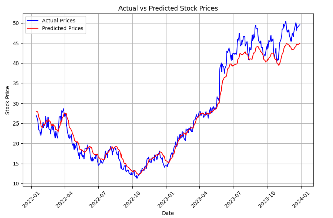

# Stock Price Prediction using LSTM and Bidirectional LSTM

This project focuses on predicting stock prices using two models: **LSTM** and **Bidirectional LSTM**, both implemented in **PyTorch**. The models are trained on historical stock price data, and their performance is evaluated using regression metrics such as MSE and RMSE.

## Table of Contents
- [Overview](#overview)
- [Dataset](#dataset)
- [Model Architectures](#model-architectures)
- [Training and Evaluation](#training-and-evaluation)
- [Results](#results)
- [Future Work](#future-work)
- [License](#license)

## Overview
In this project, we build and train two models:
1. **LSTM**: A unidirectional Long Short-Term Memory network for stock price prediction.
2. **Bidirectional LSTM**: A bidirectional version of the LSTM that processes sequences in both forward and backward directions to capture more context.

The goal is to predict the next day’s closing price of a stock based on historical price data.

## Dataset
The dataset used in this project can be found on Kaggle:  
[Nvidia Daily Stock Price Data](https://www.kaggle.com/datasets/jvanark/nvidia-daily-stock-price-data/data)

## Model Architectures

### 1. **LSTM Model**
A standard LSTM architecture for time-series prediction.

### 2. **Bidirectional LSTM Model**
A bidirectional LSTM that processes sequences in both directions for enhanced context.

## Training and Evaluation
The models are trained using the **Adam optimizer** and **MSE loss function** for 30 epochs. The performance is evaluated using metrics like **MSE** and **RMSE**.

## Results
Both models capture general trends well. The **Bidirectional LSTM** slightly outperforms the unidirectional model in terms of capturing more complex patterns.

## Future Work
- Experiment with more features (technical indicators, macroeconomic variables).
- Improve performance through hyperparameter tuning.
- Explore ensemble models for better performance.

## License
This project is licensed under the MIT License.
